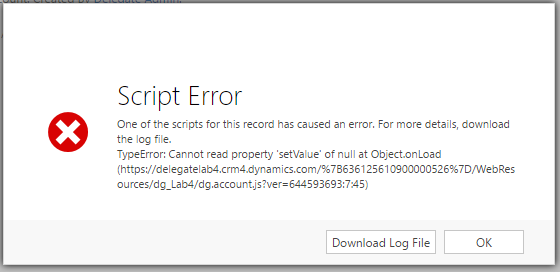

Coding and maintaining JavaScript for Dynamics 365/CRM can be quite a hassle if you don’t have a way to manage it properly. 
Besides knowing how the client-side API works, it also relies on a lot of precise strings to accomplish anything meaningful in regard to the way the specific CRM system is set up.

In this blog post, I will be focusing on the issues a developer usually encounters when coding web resources that interact with a form and its logic, 
and how these issues can be alleviated using TypeScript — with the help of a tool called [XrmDefinitelyTyped](http://delegateas.github.io/Delegate.XrmDefinitelyTyped/).


# Problems with plain JavaScript

To add logic to a form in CRM, you use the client-side API called `Xrm.Page`. By using this you can interact with attribute values, add form logic on certain events, 
and manipulate how the form looks and acts. To access elements on a form, you need to use the logical name of the element you want in a matching getter function.

```typescript
Xrm.Page.getAttribute("donotphone").getValue();
Xrm.Page.getAttribute("primarycontactid").setValue([{ id: "GUID", entityType: "contact" }]);
Xrm.Page.ui.tabs.get("some_tab").getDisplayState();
```
<div class="caption">Example usage of the form API.</div>


The problem here is that you need to know the ***exact*** string that is necessary when you want to access an attribute, a control, a tab, etc, 
in order to get that object and interact with it. 
And you better be sure that the element you are accessing in your code actually is present on the entity form — or users might experience this nasty error.

<figure>

<div class="caption">Nasty error your users will experience when an invalid string is used.</div>
</figure>

When dealing with attributes and controls, you also encounter the issue of needing to know what ***type*** the element holds. 
Is it a number attribute? A lookup field? An iframe control? JavaScript simply can't help you here.

The main problem here is that CRM is dynamic, which means that the CRM JavaScript API also has to be. 
And this leads to the need for these precise strings — also commonly known as *magic strings* in programming.

<blockquote class="big-quote">
The main problem here is that CRM is dynamic.
</blockquote>


# Enter TypeScript

[TypeScript](http://www.typescriptlang.org/) is a typed superset of JavaScript, which turns into regular JavaScript when it is run through the compiler. 
It is written as JavaScript, but you are able to put types on top of it. And with these types, you are able to get type-checking and clever intellisense and autocomplete features in your IDE — which makes it more certain that what you code is actually correct code.

Besides all the static type benefits of using TypeScript, you also get access to other nice and future features of JavaScript (ES6+), such as classes, arrow functions, template strings, destructuring and much more. 
TypeScript also allows you to structure your code in namespaces, and as such makes it easy to contain and expose functionality as necessary.


# Declaration files for CRM

Declaration files are special TypeScript files, which describe how a JavaScript library/API can be used by declaring which types and functions are available, without specifying any of the actual library implementation. 
The TypeScript compiler uses these files to infer types and check validity of your code for the described library. 
The definitions in declaration files are only used by the compiler at compile-time, and is not included in the resulting code. This means that it **does not** slow down, or add to the outputted code JavaScript in any way.

One way to use TypeScript with CRM is to use the [declaration files found on DefinitelyTyped](https://github.com/DefinitelyTyped/DefinitelyTyped/tree/master/xrm).

The problem with using these declaration files, however, is that they are ***static***. 
They are generic to the CRM API and not tailored to a specific CRM configuration, and thus can not help with the main pains/issues — like the *magic strings* and infering the types for each field.


# Dynamic declaration files to the rescue

So we can establish that since CRM is dynamic, the declaration files should be as well.

When I started working on client-side code in CRM about two years ago, I took note of this issue, and immediately started looking for a solution. 
And since no solution existed which resolved this issue, I decided to build a tool to alleviate this problem.

The tool is called [XrmDefinitelyTyped (XDT)](http://delegateas.github.io/Delegate.XrmDefinitelyTyped/) and was released to the public in April 2015. 
It has since then been [expanded with lots of new features and functionality](http://delegateas.github.io/Delegate.XrmDefinitelyTyped/release-notes.html). 
It is open-source and be found on [GitHub](https://github.com/delegateas/Delegate.XrmDefinitelyTyped), if anyone wants to take a look at the code and chip in.

<blockquote class="quote">
It is the TypeScript equivalent of <a target="_blank" href="https://msdn.microsoft.com/en-us/library/gg327844.aspx">CrmSvcUtil</a>, but instead of generating early-bound .NET classes for server-side code, 
it generates TypeScript interfaces for all your client-side coding.
</blockquote>

When the tool is run, a base declaration file is created which describes the static interface for CRM — very similar to the static one found on DefinitelyTyped. 
But with XDT, declaration files are also made specifically for each form, which describes exactly how that form can be interacted with. 
This means that the TypeScript compiler can know precisely which fields, sections, and tabs are available on it, as well as the necessary magic strings needed to perform meaningful operations.


```typescript
interface Contact extends Xrm.PageBase<Contact.Attributes,Contact.Tabs,Contact.Controls> {
  getAttribute(attributeName: "fullname"): Xrm.Attribute<string>;
  getAttribute(attributeName: "jobtitle"): Xrm.Attribute<string>;
  getAttribute(attributeName: "parentcustomerid"): Xrm.LookupAttribute;
  getAttribute(attributeName: "emailaddress1"): Xrm.Attribute<string>;
  getAttribute(attributeName: "telephone1"): Xrm.Attribute<string>;
  getAttribute(attributeName: "address1_composite"): Xrm.Attribute<string>;
  getAttribute(attributeName: "gendercode"): Xrm.OptionSetAttribute<contact_gendercode>;
  getAttribute(attributeName: "familystatuscode"): Xrm.OptionSetAttribute<contact_familystatuscode>;
…
```
<div class="caption">
Snippet from a generated declaration file which describes a contact form.
</div>

Besides declarations for forms, it can also generate interfaces for entities to be used in API calls towards the database — both the old REST endpoint ***and the new Web API***.


# Developer efficiency

Having TypeScript along with the dynamic declaration files immensely improves the development experience when dealing with the JavaScript APIs of CRM. 
Having the code **checked for validity at compile-time** (instead of at run-time — on the CRM form) helps you save a lot of time developing and maintaining code. 
You can be certain that the code you have written is correct according to the API, without typos, and that all the magic strings are correctly typed and valid in the given context.

Not only does it check that the string parameters are correct, but it can even autocomplete them for you! 
The other major benefit is that the compiler also knows exactly what type of attribute/control/entity it should expect at all times.

Besides the form logic declaration files, XDT also includes TypeScript libraries for making calls towards the database. 
These makes it possible to create calls to the CRM database in a completely type-safe manner with a LINQ-like query syntax, instead of having to construct your own OData query strings. 
This library is called [XrmQuery](http://delegateas.github.io/Delegate.XrmDefinitelyTyped/xrmquery-web.html), and it exists in two instances, one for each of the OData endpoints. The libraries work in tandem with declaration files generated by 
XDT specifically for that purpose. In a later blog post I will be addressing XrmQuery in more detail.

<figure>
  <video width="100%" controls="true" muted="true">
    <source src="xdt-demo-x1_25.mp4" type="video/mp4">
    Your browser does not support the video tag.
  </video>
  <figcaption>Demonstration of various TypeScript features with XrmDefinitelyTyped (2min)</figcaption>
</figure>


# Upgrade your code now — no excuses

Using the [quick-start guide](http://delegateas.github.io/Delegate.XrmDefinitelyTyped/getting-started.html), you can get your project set up with XDT in a few minutes. 
Converting your code to TypeScript is usually quite straightforward. Just change your files from `.js` to `.ts`, and then the compiler will tell you exactly what may be problematic with the current code, which makes it quick and easy to fix.